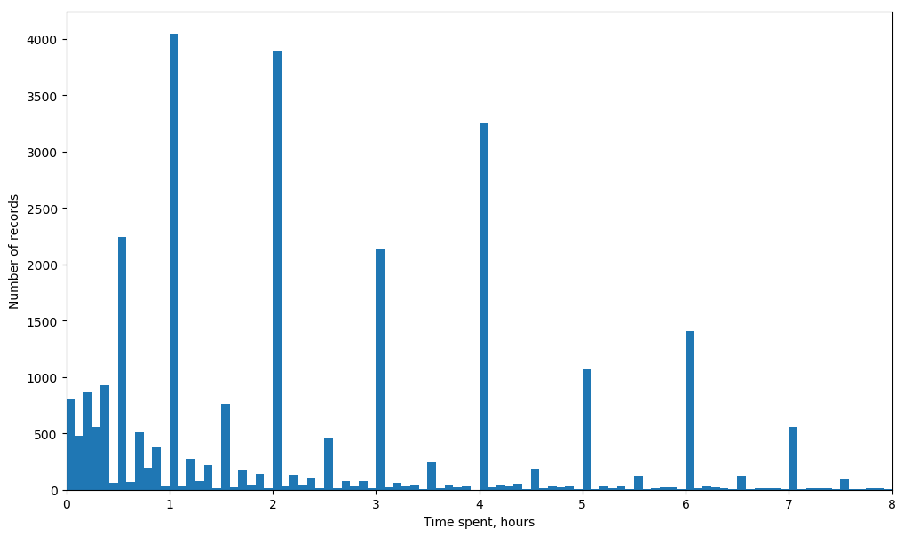
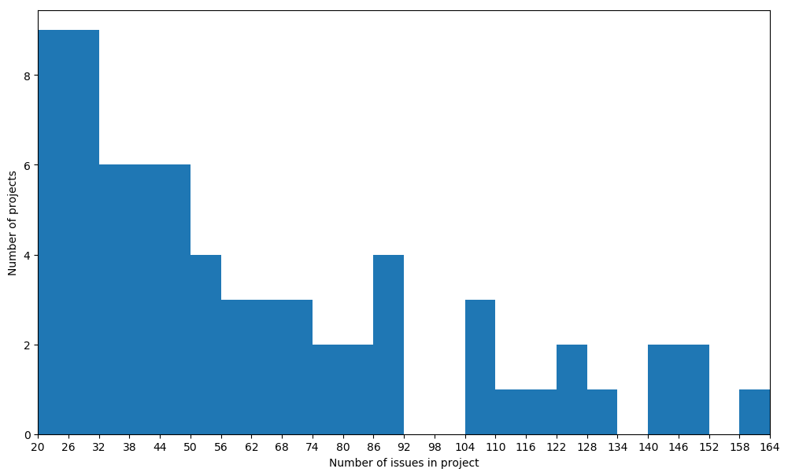
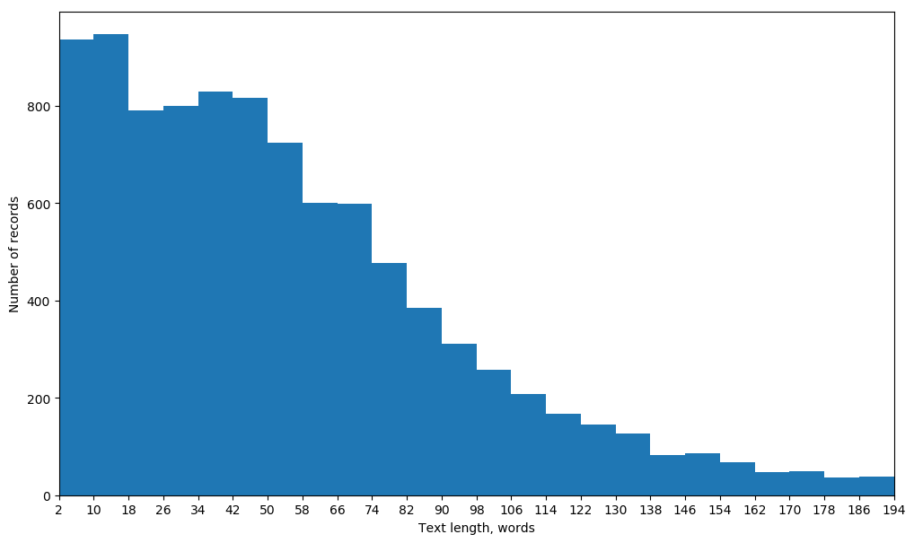

# Bestimate
Bestimate lets you train a neural network model to estimate JIRA issues from public and private repositories. The solution was developed as a part of a master thesis project at Norwegian University of Science and Technology in Spring 2018. The accuracy is not close to human expert, but this can be used as a basis for developing a more sophisticated model which maybe in the future will let us code without estimating.

## 1. Data Collection
The model uses JIRA issue summary and description field text and reported time spent on issue completion to learn the relationship between them. If you will be running the model on a private JIRA repository, please jump over to [Fetching Data from JIRA Repository](#fetching-data-from-jira-repository). If you want to fetch data from several publicly available JIRA repositories with a single command, check [Bulk Fetch](#bulk-fetch). This package contains a list of publicy available JIRA repositories gathered by an exhaustive search on the Internet. However, you can use the commands described in the next section to find new publicly available repositories.

### Discovering Publicly Available JIRA Repositories
To find new repositories using [Bing Web Search API](https://azure.microsoft.com/en-us/services/cognitive-services/bing-web-search-api/) or [Google Custom Search Engine API](https://cse.google.com/cse/), run the following command:
```
python -m data_collection.discover_repos
```
You will be asked to provide Google API key and Google Custom Search Engine ID or Bing Web Search API key. Both search engines offer free trial versions of their products. Bing does not requre other setup than just a simple registration as opposed to Google which needs to be configured to search the whole web by following the first two steps in this [Stack Overflow answer](https://stackoverflow.com/a/37084643). Bing search results are not limited, but Google allows you to access only the first 100 search results for each query. Therefore you might want to collect the potential links manually and add them to [/data_collection/potential_repos.txt](data_collection/potential_repos.txt) file by separating each URL with a line break and then running the following command to test if they link to a public JIRA repository:
```
python -m data_collection.test_repos
```

### Fetching Data from JIRA Repository
To fetch data from a single private or public JIRA repository, run the following command:
```
python -m data_collection.fetch_data
```
You will be asked to provide the URL of the JIRA repository, e.g. "jira.exoplatform.org" and an identifier of the repository, which will be used to identify the fetched data when composing a new training dataset. A new request to JIRA REST service is made for each 50 record chunk due to JIRA's constraints until all records are loaded. You can sign in to the JIRA repository by username and [API token](https://confluence.atlassian.com/cloud/api-tokens-938839638.html) to gain access to more data. If the API token is not working, an alternative is to create a new user account and use its password instead of the API key.

### Bulk Fetch

As a part of this research project, 32 publicly available JIRA repositories, each containing at least 100 resolved issues with time spent greater than zero, were found and listed at [/data_collection/known_repos.json](data_collection/known_repos.json). The total number of labeled issues exceeds 63,000 and the number of unlabeled issues exceeds 2,000,000. You can fetch data from all of these these repositories by running this command:
```
python -m data_collection.bulk_fetch
```
You can add more repository identifier and URL pairs to [/data_collection/known_repos.json](data_collection/known_repos.json) to fetch those when you run the command. If a folder with a known repository identifier already exists in [/raw_data](raw_data) folder, it will not be reloaded when running the command unless you manually delete it.

## 2. Data Preprocessing
Before training, the raw fetched datapoints are processed by cleaning textual task descriptions from noise, data from several repositories is merged in a training dataset and filters are applied to the resulting training dataset.

### Cleaning Text
Raw task textual descriptions fetched from JIRA REST API contain noise such as markup tags, code snippets, stack trace, links and programming object names. These can be removed by running the following command:
```
python -m data_preprocessing.clean_text
```
Both a data from a single repository, a selection of repositories or all downloaded repositories can be cleaned by running this command. Each text fragment is divided in sentences for pretraining purposes. An alpha density ratio is calculated indicating the number of alphabetic characters and apostrophes compared to the total number of characters except whitespaces in the description field. All records are sorted by the alpha density so that the text with possibly most noise comes first. Then all datapoints are saved in a JSON format to the repository subfolder in [/raw_data](raw_data) folder.

### Merging Data from Multiple Repositories, Selecting and Excluding Projects
Datasets for model training and testing are composed from the cleaned data fetched from JIRA repositories. At this stage data from several JIRA repositories can be merged together and particular projects can be selected or excluded from the training and testing datasets.
```
python -m data_preprocessing.merge_data
```
If you whish to create a training and testing dataset from one repository only, just pass the name of that single repository. If no datasets are selected, all available datasets will get merged together in a new dataset. Each new merged dataset is automatically assigned a hexadecimal sequence number and saved in `data/merged` folder.

### Filtering Merged Data To Create Training Dataset
Datapoints with short textual descriptions, extreme outliers and small projects can be removed as well as skewed data distributions can be made even by using the filtering module. The module can also make skewed data distributions even by removing datapoints from any bins that are more populated than the least populated one.
```
python -m data_preprocessing.filter_data
```
Replace `A` with the hexadecimal sequence number of the training and testing dataset which you wish to filter.

## Insights
The statistics module allow you to get to know the data better.

### Time Spent Distribution
```
python -m insights.label_distribution A
```
To create a histogram of `timespent` field distribution, replace `A` with the hexadecimal sequence number of the training and testing dataset which you wish explore. Since the model tries to predict `timespent` it is also called "label". A histogram like the one below will be generated and saved in `data/statistics` directory.


### Project Size Distribution
```
python -m insights.project_size A
```
To create a histogram of project size distribution, replace `A` with the hexadecimal sequence number of the training and testing dataset which you wish to explore. Project size is defined as the number of labeled issues in a project. A histogram like the one below will be generated and saved in `data/statistics` directory.


### Text Length Distribution
```
python -m insights.text_length A
```
To create a histogram of text length, replace `A` with the hexadecimal sequence number of the training and testing dataset which you wish to explore. Text length is measured as the number of words in summary and description fields of labeled tasks. A histogram like the one below will be generated and saved in `data/statistics` directory.


## Training

To train a model on the data with a particular configuration:
```
python -m training.train
```
To run hyperparameter optimization on a particular model architecture:
```
python -m training.hypopt EMBEDDING_TYPE LSTM_COUNT CONTEXT_TRANSFORMATION_TYPE TRAINING_DATASET_ID MIN_PROJECT_SIZE MIN_WORD_COUNT WORKERS TRAINING_SESSION_ID
```
- EMBEDDING_TYPE: `spacy` for word vectores trained on general English text corpus or `gensim` for word embeddings pretraining on unlabeled data
- LSTM_COUNT: `1` for single LSTM context encoding network; `2` for separate LSTM networks for task summary and descriptions fields; `bi` for bidirectional LSTM
- CONTEXT_TRANSFORMATION_TYPE: `dense` for interconnected network or `hway` for a highway network
- TRAINING_DATASET_ID: the identifier of a merged training dataset
- MIN_PROJECT_SIZE: minimum number of resolved issues with time spent logged in a project necessary to be selected for training
- MIN_WORD_COUNT: minimum word count in summary and description field concatenated
- WORKERS: the number of workers for the training process
- TRAINING_SESSION_ID: optional parameter, the identifier of an interuppted hyperparameter optimization training session that is to be continued

